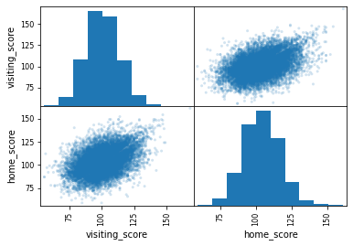
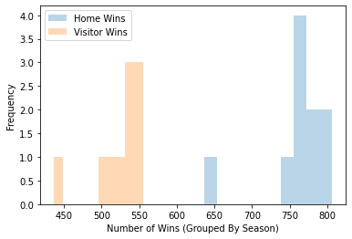

# Is Home Court Advantage Real?

Home court advantage is the idea that sport teams playing at their home arena have a slight upperhand compared to the visiting team. This project aims to explore the idea of home court advantage and whether or not it is a real thing - specifically focusing on professional basketball (NBA).

## Background and Motivation

As someone who was born and raised in New York City, I am the typical depressed NY sports fan. Who doesn't like getting a little rowdy and rooting for their home team? NYC is home to the most valuable NBA franchises - the Knicks. Just being in NYC in general generates a ton of spectators per game. While Madison Square Garden is covered in shining lights and belting out lively music, I can't help but wonder if home court advantage is truly a thing when it comes to the Knicks? What about the Nets?

## Hypothesis

First I explored the idea of whether or not home court advantage was real. 

* H0: There is no such thing as home court advantage. p = 0.5
* HA: There is such a thing as home court advantage. p > 0.5

Then I repeated the same test but specifically for the New York Knicks and the Brooklyn Nets.

Knicks: 
* H0: Knicks have no home court advantage. p = 0.5
* HA: Knicks have a home court advantage. p > 0.5

Nets:
* H0: Nets have no home court advantage. p = 0.5
* HA: Nets have a home court advantage. p > 0.5

## Data

I scraped all the data from [https://www.basketball-reference.com/](https://www.basketball-reference.com/). The data was broken up by basketball season and by month which included game schedule information as well as home vs. visiting teams and their respective scores. I created a webscraper to parse the HTML through BeautifulSoup, which was then passed into a MongoDB. The scraper handles one month of a season at a time - by looping through all the months in a season and repeating for all existing seasons, I was able to collect data for all seasons that exists. Then using PyMongo and Pandas, I converted the collections in dataframs for easy manipulation. 

Given that I had a ton of data, I decided to focus on the most recent ten completed NBA seaasons - skipping over 2019-2020 season. I decided to skip over the 2019-2020 season because the season was very different in nature compared to the other seasons given covid. For the last couple of months in the 2019-2020 season, NBA teams had entered a "bubble" where they played at a neutral arena - thus there was no such thing as a "home team" for those given games. Additionally, I had decided to drop some rows of data following the same logic as previously stated. Some sporadic games were played at a netural arena. It was a total of 17 games, and given the small number compared to the ~13K games I had, I decided to drop the 17 rows. 

In total, I collected 12,873 rows of data across teams and seasons. For the respective test for Knicks and Nets, I filtered from the 12,873 rows. 

## Exploratory Data Analysis

Once I gathered and filtered out the data that I needed, I created a scatter-matrix. The graphs look as expected. 

I then created a histogram of number of wins grouped by season. At this point it is hard to not notice that all of home wins fall to the right of visitor wins - home wins by season have been not only higher but frequently higher. 

## Results 

Is home court advantage real?

Using a one sample t-test of population proportions: 
* p = 0.5 
* significance level = 0.05
* n = 12873 games 
* test statistic = 7626 home games won 
Reject the null

Does the Knicks have a home cour† advantage?

Using a one sample t-test of population proportions: 
* p = 0.5 
* significance level = 0.05
* n = 822 games 
* test statistic = 193 home games won 
Fail to reject the null

Does the Nets have a home court advantage?

Using a one sample t-test of population proportions: 
* p = 0.5 
* significance level = 0.05
* n = 601 games 
* test statistic = 339 home games won 
Fail to reject the null

For all three tests I used a one sample t-test, however I could have also used a two sample t-test of population proportions (i.e. there is no difference between proportion of games won by home teams vs proportion of games won by away teams).

## Conclusions

While home court advantage is real, not all teams have a home court advantage. 

## Looking Forward 

* Home court advantage for other teams
* Effects of home court advantage on certain metrics (i.e. foul shots)
* Explore how neutral arenas affect team performance (covid NBA bubble)